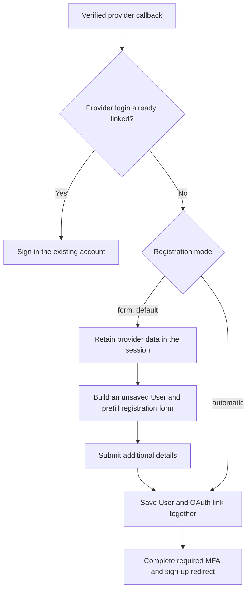

# OAuth sign-in

## Contents

- [Add GitHub sign-in](#add-github-sign-in)
- [Choose registration behavior](#choose-registration-behavior)
- [Prefill and extend the registration form](#prefill-and-extend-the-registration-form)
- [Retain additional provider data](#retain-additional-provider-data)
- [Handle automatic registration failures](#handle-automatic-registration-failures)
- [Routes and custom controllers](#routes-and-custom-controllers)
- [Existing OAuth storage](#existing-oauth-storage)

## Add GitHub sign-in

Start with the [standard Vouch setup](../README.md#install-and-generate-a-login), then generate GitHub sign-in:

```sh
bin/rails generate vouch:omniauth User --provider github
```

The generator adds:

- An `OauthIdentity` model and migration, associated with `User`.
- The OAuth feature and association on `User`.
- `Users::OmniAuthsController` and its callback routes.
- `config/initializers/vouch_omniauth_github.rb`, which connects the GitHub strategy to those routes.

Choose the model that owns authentication:

- **Single-tenant:** use the command above for `User`.
- **Multi-tenant:** use `bin/rails generate vouch:omniauth Account --provider github` when `Account` owns the password and `User` is a membership.

Install the provider packages before starting the application or running migrations with the generated initializer:

```sh
bundle add omniauth omniauth-github omniauth-rails_csrf_protection
```

Add GitHub's client ID and secret to Rails credentials using the keys read by the generated initializer:

```yaml
github:
  client_id: your-client-id
  client_secret: your-client-secret
```

On Rails 8.2+, the initializer reads these with `Rails.app.creds.require`; on earlier Rails versions it uses `Rails.application.credentials.dig`. Register `/users/auth/github/callback` as the callback path with GitHub, or `/accounts/auth/github/callback` for the multi-tenant command.

The ordinary `User` migration creates:

```ruby
create_table :oauth_identities do |t|
  t.references :user, null: false, foreign_key: true
  t.string :provider, null: false
  t.string :uid, null: false
  t.json :auth_data
  t.timestamps
  t.index [:provider, :uid], unique: true
end
```

An existing compatible table or migration is reused; the generator does not overwrite an existing model. For an existing table, it checks the required columns and reports incompatible storage.

```sh
bin/rails db:migrate
```

Start sign-in with a POST button. OmniAuth handles this request and redirects to GitHub:

```erb
<%= button_to "Sign in with GitHub", "/users/auth/github", data: { turbo: false } %>
```

When GitHub returns, OmniAuth verifies the response and passes it to Vouch. A previously linked provider login signs in its account. If someone is already signed in, the callback links the provider login to that account. A provider login already linked to another account cannot be reassigned this way.

## Choose registration behavior

New provider logins use your registration form by default:

```ruby
# Inside the User scope in config/routes.rb
auth.oauth_callbacks registration: :form
```



For an application where provider data supplies everything needed to register, opt into automatic registration instead:

```ruby
auth.oauth_callbacks registration: :automatic
```

The controller method `oauth_registration_required?` remains an override point for a decision that varies by request. Returning `true` chooses the form; returning `false` attempts automatic creation. Its default follows the route setting.

## Prefill and extend the registration form

With `:form`, the callback stores selected provider data in the Rails session. `RegistrationsController#new` builds an **unsaved** record from that data. The generated model-bound form displays its values and omits password fields. Neither the account nor its OAuth link exists in the database yet.

The default mapping supplies `email_address` and an unguessable password. To also prefill an existing `name` attribute:

```ruby
# app/models/user.rb
class User < ApplicationRecord
  def self.oauth_attributes_for_creation(auth_hash)
    super.merge(name: auth_hash.info.name)
  end
end
```

Add the input inside the generated form:

```erb
<%# app/views/users/registrations/new.html.erb, inside form_with %>
<%= form.label :name %>
<%= form.text_field :name %>
```

Permit edits to that value:

```ruby
# app/controllers/users/registrations_controller.rb
class Users::RegistrationsController < Vouch::RegistrationsController
  private

  def account_params
    super.merge(params.require(:user).permit(:name))
  end
end
```

On submission, Vouch builds from the retained provider data again and applies permitted form values. Validation errors re-render that record with its errors. A successful submission saves the account and OAuth link in the same transaction. The provider and UID come from the retained callback, never from editable form fields.

For multi-tenant registration, that transaction also saves the organisation and membership constructed by your registration methods. See [registration construction](registration.md#construct-records-transactionally) for the organisation name input and shared construction methods. After registration and required authentication steps, [the sign-up redirect](registration.md#send-people-to-onboarding) can send the person to onboarding.

The continuation expires after `pending_authentication_ttl`, configurable as shown in [pending sign-in timeout](authentication-policy.md#pending-sign-in-timeout).

## Retain additional provider data

Vouch retains the provider, UID, and the `email`, `name`, and `image` profile fields during the form step. For another value, extend serialization before the callback redirects to registration. This example assumes `User` already has a `provider_nickname` column:

```ruby
# app/controllers/concerns/retains_provider_nickname.rb
module RetainsProviderNickname
  private

  def serialize_oauth(auth_hash)
    super.tap do |payload|
      payload["info"]["nickname"] = auth_hash.info.nickname.to_s.first(100)
    end
  end
end
```

```ruby
# app/controllers/users/omni_auths_controller.rb
class Users::OmniAuthsController < Vouch::OmniAuthsController
  include RetainsProviderNickname
end
```

The default parser reconstructs the retained hash. Map it onto the unsaved record:

```ruby
# app/models/user.rb
class User < ApplicationRecord
  def self.oauth_attributes_for_creation(auth_hash)
    super.merge(provider_nickname: auth_hash.info.nickname)
  end
end
```

To let the person change it, add `form.text_field :provider_nickname` inside the generated form and permit it in `account_params`, following the `name` example above. Without that input, the mapped value is saved unchanged after successful registration.

Keep retained session data small. Provider access tokens are not retained by the default serializer; an application that needs later provider API access should store them in its own encrypted storage.

## Handle automatic registration failures

An automatic signup can fail because a required attribute is missing, an email is already registered, or a registration callback cancels it. Vouch rolls back failed record creation and redirects with an alert. It returns to the same-origin page that initiated the provider request when available, otherwise to sign-in. It does not silently switch to the registration form.

The initiation page is captured in the Rails session when the POST to the provider starts. The provider callback's referrer is not used. This return path affects registration failure only; successful registration keeps its normal sign-up destination.

Expected failures call `oauth_registration_failed`. Override it to add reporting while retaining the redirect:

```ruby
# app/controllers/users/omni_auths_controller.rb
class Users::OmniAuthsController < Vouch::OmniAuthsController
  private

  def oauth_registration_failed(reason:, error: nil)
    Rails.logger.info("OAuth registration failed: #{reason}")
    Rails.error.report(error, handled: true) if error
    super
  end
end
```

Reasons are `:validation`, `:conflict`, `:cancelled`, `:aborted`, or `:completion`. Expected failures are not automatically sent to an error reporter. Unexpected exceptions propagate through Rails error handling. Provider authentication failure itself uses the `failure` action and returns to sign-in.

## Routes and custom controllers

| Request | Handler | Purpose |
| --- | --- | --- |
| `POST /users/auth/github` | OmniAuth middleware | Start the provider exchange. |
| `GET /users/auth/:provider/callback` | `Users::OmniAuthsController#callback` | Link, sign in, or start registration after provider verification. |
| `GET /users/auth/failure` | `Users::OmniAuthsController#failure` | Return to sign-in after provider failure. |

Providers that POST their callback require that HTTP method on the callback route:

```ruby
auth.oauth_callbacks callback_methods: [:get, :post]
```

For custom paths, configure the same callback address in the provider dashboard, OmniAuth middleware, and Vouch's `callback_path:` option. `failure_path:` changes the failure endpoint. These route options do not configure the provider strategy or its credentials.

Edit the generated subclass for small overrides. To take ownership of the complete callback controller:

```sh
bin/rails generate vouch:eject users omni_auths
```

See [controller ejection](controllers.md#eject-a-controller) for the generated implementation file.

## Existing OAuth storage

Vouch identifies a provider login by the pair `provider` and `uid`. A matching email alone never authorizes linking. For a differently shaped identity model, override its `find_from_omniauth` lookup and `oauth_attributes` mapping together, maintaining uniqueness for the provider's stable identifier.

An existing polymorphic association can be mapped explicitly:

```ruby
# app/models/oauth_identity.rb
class OauthIdentity < ApplicationRecord
  include Vouch::OAuthIdentity::Concern
  belongs_to :oauthable, polymorphic: true
end

# app/models/account.rb
class Account < ApplicationRecord
  has_many :oauth_identities, as: :oauthable, dependent: :destroy
end
```

```ruby
# Inside Vouch.routes in config/routes.rb
auth.scope model: "Account", associations: {omniauthable: :oauth_identities, oauth_account: :oauthable} do
  auth.sessions
  auth.registrations
  auth.oauth_callbacks
end
```

This describes existing storage; the ordinary generator creates a concrete owner foreign key.
