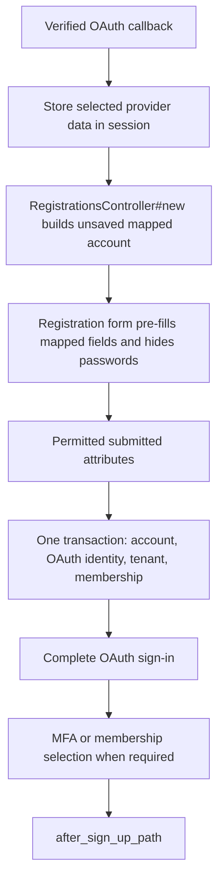

# Registration

## Contents

- [Standard registration](#standard-registration)
- [OAuth registration continuation](#oauth-registration-continuation)
- [Construct records transactionally](#construct-records-transactionally)
- [Send people to onboarding](#send-people-to-onboarding)

## Standard registration

The generated registration form creates an account using an email address and password. It posts permitted account fields to `RegistrationsController`, which validates and persists the account. Add ordinary fields to the form and `account_params`; see [sign-in customization](sign-in-customization.md#customize-the-registration-form).

## OAuth registration continuation

Configure OAuth callback registration with `:form` (the default) when a new provider identity needs fields that OAuth does not supply:

```ruby
auth.oauth_callbacks registration: :form
```

After the provider callback is verified, Vouch retains selected provider data in the session and redirects to `RegistrationsController#new`. It builds an unsaved account mapped from that data, pre-fills the form, and writes no account or identity row yet. The generated registration form uses `oauth_registration?` to omit password fields during that pending OAuth continuation.

On submit, Vouch combines the mapped account fields with permitted form fields and creates the account and OAuth link in one transaction. In a multi-tenant setup, that transaction also includes the organisation and membership. It then continues through MFA and membership selection before redirecting. Validation failures re-render the form. Provider/UID data comes from protected session state, never submitted fields.

The default mapping uses the provider email and an unguessable password. Add another mapped form value through the account model:

```ruby
def self.oauth_attributes_for_creation(auth_hash)
  super.merge(name: auth_hash.info.name)
end
```



## Construct records transactionally

`build_tenant` and `build_identity` return unsaved records. Vouch calls `create_registration_identity!` inside the registration transaction after the account is valid. The methods below construct the organisation and membership; they must not save them themselves.

```ruby
# app/controllers/concerns/provisions_organisation.rb
module ProvisionsOrganisation
  extend ActiveSupport::Concern

  private

  def build_identity(account, tenant:)
    tenant.users.build(account: account)
  end
end
```

Include the same concern in registrations and, when using automatic OAuth registration, in the callback controller. This keeps construction consistent for password signup, form OAuth continuation, and the explicit automatic OAuth opt-in:

```ruby
# app/controllers/accounts/registrations_controller.rb
class Accounts::RegistrationsController < Vouch::RegistrationsController
  include ProvisionsOrganisation

  private

  def build_tenant(_account)
    Organisation.new(params.require(:organisation).permit(:name))
  end
end

# app/controllers/accounts/omni_auths_controller.rb
class Accounts::OmniAuthsController < Vouch::OmniAuthsController
  include ProvisionsOrganisation

  private

  def build_tenant(account)
    Organisation.new(name: "#{account.email_address}'s organisation")
  end
end
```

Automatic registration has no submitted organisation form. The example above chooses a default name; use `registration: :form` when the person must choose it.

The registration form owns the tenant input. Keep it separate from account parameters:

```erb
<%= text_field_tag "organisation[name]", params.dig(:organisation, :name), required: true %>
```

For form OAuth registration, `RegistrationsController#create` rebuilds the mapped unsaved account, assigns only `account_params`, and then creates the account, OAuth identity, tenant, and membership in that transaction. A validation failure renders `app/views/accounts/registrations/new.html.erb` again with errors and no persisted account/link. Provider and UID never come from form fields.

## Send people to onboarding

After registration succeeds, choose where the person goes next. A shared redirect preserves the destination when signup finishes through an MFA controller:

```ruby
# app/controllers/application_controller.rb
class ApplicationController < ActionController::Base
  protected

  def after_sign_up_path_for(record, scope:)
    onboarding_path
  end
end
```

`onboarding_path` is a page you create for any remaining introduction or profile steps. Put required database work in a transactional hook and external work such as a welcome email in `after_commit_of_sign_up`; see [lifecycle hooks](sessions-and-hooks.md#lifecycle-hooks).
